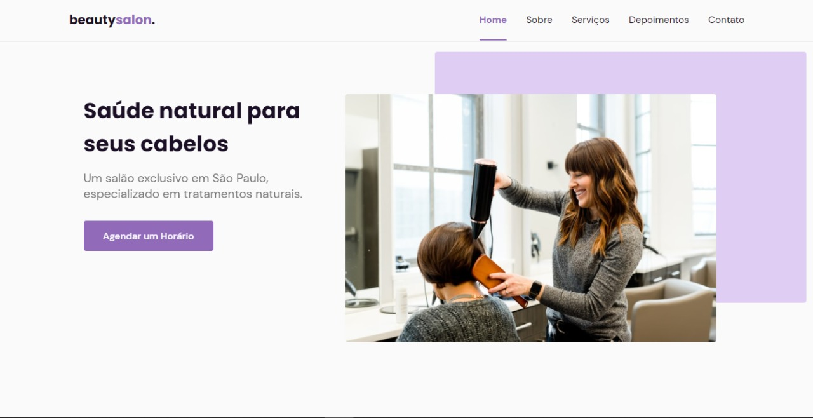

# BeautySalon. - OriginSix (NLW - Together)

<!---Esses são exemplos. Veja https://shields.io para outras pessoas ou para personalizar este conjunto de escudos. Você pode querer incluir dependências, status do projeto e informações de licença aqui--->

* Link do Projeto [Ir para site](https://paulo-2048.github.io/originsix/)

> Projeto Desenvolvido durante a NLW-Together, promovida pela Rocketseat. O foco durante essa trilha foi nas bases da Web, HTML, CSS e JS

### Ajustes e melhorias

O site já foi finalizado, com os seguintes aprendizados:

- [x] Site responsivo, seguindo o modelo de Mobile-Fist
- [x] Conceitos de HTML, CSS e JS
- [x] Implementação de 2 bibliotecas
- [x] Exportação para o GitHub
- [x] Link Ativo

[⬆ Voltar ao topo](#originsix) 
